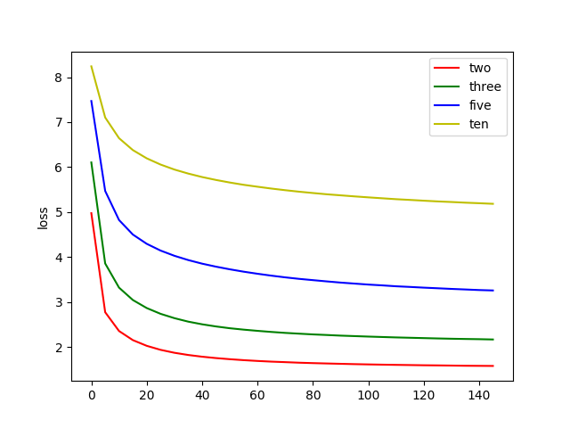
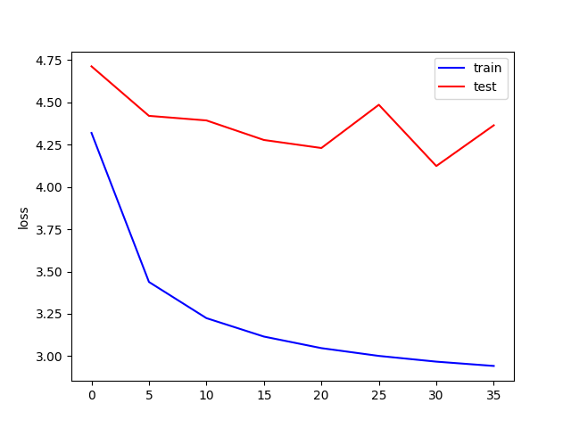
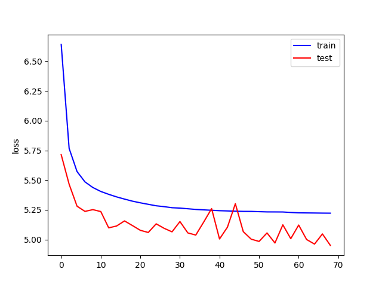
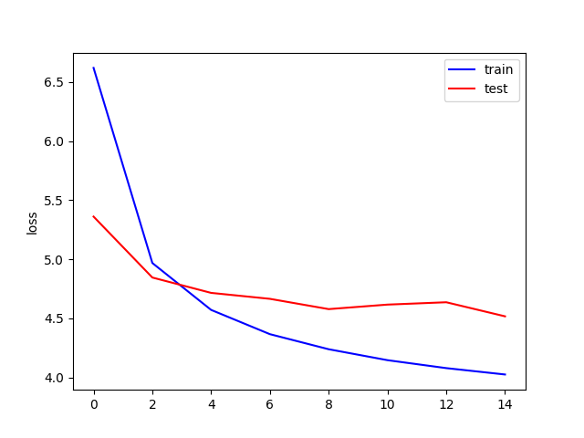
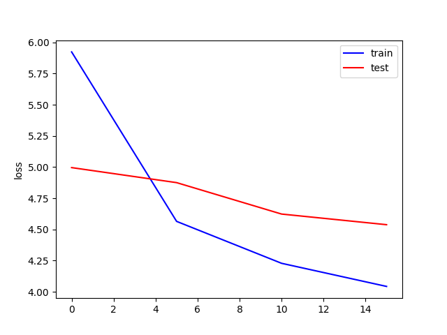

# DeepOrchestration

> It is a cool project using deep learning to help ochestration. Fighting!

### The first try is to implement cnn
#### Experiment on instrument regconition 
- take N(currently 2) instruments from TinySOL and then combine 
- take melspectrogram features (128*128, if the combined pieces are small, just add zeros)
- design a multi-label model and use one-hot encoding and cross entropy loss function 
- after 200 epochs training on gpu, accuracy results of every instruments shown as follow

 

#### Experiment on one-class-per-file recognition
- Take a similar way to deal with the data
- After 200 epochs training on gpu, results of every instruments shown

- Total acc and single acc are shown, which reaches 86.625 %.

### The second try is to use resnet
- the way to deal with data is similar
- take a classic model of resnet, but remove one maxpool layer to fit data 
- The training is slower and the current model does not perform as good as cnn
- Try different paras which is more suitable to solve our problem
- A comparison of total accuracy between cnn and resnet shown

### Other Architectures

#### CNN+LSTM+CNN
Best acc: 91.963%

### Experiment on mixtures of 2,3,5,10
#### Loss:

#### Accuracy Table:
|   exp |   2   |   3   |   5   |   10  |
|   ---------- |   ---------- |   ---------- |   ---------- |   ---------- |
|   accuracy | 1/2: 15.350%   2/2: 84.470% | 1/3: 3.680%   2/3: 40.850%   3/3: 55.340% | 1/5: 0.470%   2/5: 5.800%   3/5: 33.940%   4/5: 49.590%   5/5: 10.170% | 1/10: 0.040%   2/10: 0.890%   3/10: 5.300%   4/10: 19.130%   5/10: 34.120%   6/10: 29.130%   7/10: 9.970%   8/10: 1.360%   9/10: 0.060%   10/10: 0.000% |
|   each instrument | Va: 786.0/815.0 = 96.442%   Cb: 568.0/702.0 = 80.912%   Vns: 807.0/829.0 = 97.346%   Vc: 772.0/793.0 = 97.352%   BTb: 946.0/1127.0 = 83.940%   Fl: 1077.0/1111.0 = 96.940%   Vn: 672.0/714.0 = 94.118%   Hn: 661.0/973.0 = 67.934%   BTbn: 671.0/732.0 = 91.667%   BClBb: 890.0/908.0 = 98.018%   ClBb: 803.0/842.0 = 95.368%   TpC: 453.0/489.0 = 92.638%   TTbn: 897.0/1124.0 = 79.804%   BFl: 186.0/188.0 = 98.936%   CbTb: 802.0/839.0 = 95.590%   Picc: 635.0/638.0 = 99.530%   ClEb: 260.0/261.0 = 99.617%   Acc: 1401.0/1437.0 = 97.495%   Ob: 1069.0/1129.0 = 94.686%   EH: 731.0/741.0 = 98.650%   CbFl: 224.0/224.0 = 100.000%   Bn: 1008.0/1139.0 = 88.499%   Vas: 768.0/785.0 = 97.834%   Vcs: 758.0/781.0 = 97.055%   ASax: 341.0/433.0 = 78.753%   CbClBb: 243.0/246.0 = 98.780% | Va: 1002.0/1151.0 = 87.055%   Cb: 662.0/1169.0 = 56.630%   Vns: 1267.0/1323.0 = 95.767%   Vc: 976.0/1119.0 = 87.221%   BTb: 1276.0/1694.0 = 75.325%   Fl: 1519.0/1628.0 = 93.305%   Vn: 908.0/1111.0 = 81.728%   Hn: 796.0/1434.0 = 55.509%   BTbn: 795.0/1161.0 = 68.475%   BClBb: 1345.0/1418.0 = 94.852%   ClBb: 1153.0/1238.0 = 93.134%   TpC: 678.0/793.0 = 85.498%   TTbn: 1242.0/1706.0 = 72.802%   BFl: 275.0/281.0 = 97.865%   CbTb: 1170.0/1315.0 = 88.973%   Picc: 883.0/909.0 = 97.140%   ClEb: 366.0/371.0 = 98.652%   Acc: 1893.0/2063.0 = 91.760%   Ob: 1399.0/1673.0 = 83.622%   EH: 971.0/1043.0 = 93.097%   CbFl: 340.0/346.0 = 98.266%   Bn: 1239.0/1635.0 = 75.780%   Vas: 1177.0/1224.0 = 96.160%   Vcs: 1077.0/1168.0 = 92.209%   ASax: 357.0/645.0 = 55.349%   CbClBb: 374.0/382.0 = 97.906% | Va: 1357.0/1987.0 = 68.294%   Cb: 730.0/1845.0 = 39.566%   Vns: 1869.0/2370.0 = 78.861%   Vc: 1391.0/2005.0 = 69.377%   BTb: 1907.0/2767.0 = 68.919%   Fl: 2424.0/2781.0 = 87.163%   Vn: 1085.0/1947.0 = 55.727%   Hn: 959.0/2333.0 = 41.106%   BTbn: 1037.0/1867.0 = 55.544%   BClBb: 2033.0/2358.0 = 86.217%   ClBb: 1695.0/1971.0 = 85.997%   TpC: 1046.0/1323.0 = 79.063%   TTbn: 1686.0/2769.0 = 60.888%   BFl: 534.0/554.0 = 96.390%   CbTb: 1625.0/2112.0 = 76.941%   Picc: 1381.0/1472.0 = 93.818%   ClEb: 601.0/625.0 = 96.160%   Acc: 2954.0/3506.0 = 84.256%   Ob: 2149.0/2832.0 = 75.883%   EH: 1531.0/1728.0 = 88.600%   CbFl: 465.0/480.0 = 96.875%   Bn: 1767.0/2816.0 = 62.749%   Vas: 1633.0/2000.0 = 81.650%   Vcs: 1490.0/1994.0 = 74.724%   ASax: 406.0/960.0 = 42.292%   CbClBb: 555.0/598.0 = 92.809%  | Va: 1362.0/3826.0 = 35.599%   Cb: 934.0/3755.0 = 24.874%   Vns: 2183.0/4539.0 = 48.094%   Vc: 1651.0/3890.0 = 42.442%   BTb: 2546.0/5454.0 = 46.681%   Fl: 4163.0/5504.0 = 75.636%   Vn: 1213.0/3682.0 = 32.944%   Hn: 994.0/4690.0 = 21.194%   BTbn: 1173.0/3935.0 = 29.809%   BClBb: 3243.0/4720.0 = 68.708%   ClBb: 2838.0/3958.0 = 71.703%   TpC: 1608.0/2657.0 = 60.519%   TTbn: 1837.0/5695.0 = 32.256%   BFl: 893.0/1059.0 = 84.325%   CbTb: 2041.0/4279.0 = 47.698%   Picc: 2713.0/3011.0 = 90.103%   ClEb: 1093.0/1224.0 = 89.297%   Acc: 4663.0/6720.0 = 69.390%   Ob: 3686.0/5780.0 = 63.772%   EH: 2745.0/3620.0 = 75.829%   CbFl: 877.0/1062.0 = 82.580%   Bn: 2720.0/5601.0 = 48.563%   Vas: 2007.0/4044.0 = 49.629%   Vcs: 1467.0/4018.0 = 36.511%   ASax: 418.0/2041.0 = 20.480%   CbClBb: 1015.0/1236.0 = 82.120%  |

### 5-mixture exp on more data (250,000)

#### loss: 

 

overfitting 

#### try to add L1, L2 regularization

L2: weight decay: 0.005

L2: weight decay: 1e-6

L1: weight decay: 0.01

