# DeepOrchestration

> It is a cool project using deep learning to help ochestration. Fighting!

### The first try is to implement cnn
#### Experiment on instrument regconition 
- take N(currently 2) instruments from TinySOL and then combine 
- take melspectrogram features (128*128, if the combined pieces are small, just add zeros)
- design a multi-label model and use one-hot encoding and cross entropy loss function 
- after 200 epochs training on gpu, accuracy results of every instruments shown as follow

 

#### Experiment on one-class-per-file recognition
- Take a similar way to deal with the data
- After 200 epochs training on gpu, results of every instruments shown

- Total acc and single acc are shown, which reaches 86.625 %.

### The second try is to use resnet
- the way to deal with data is similar
- take a classic model of resnet, but remove one maxpool layer to fit data 
- The training is slower and the current model does not perform as good as cnn
- Try different paras which is more suitable to solve our problem
- A comparison of total accuracy between cnn and resnet shown

### Other Architectures
#### BottleNeck
Best acc: 84.875%

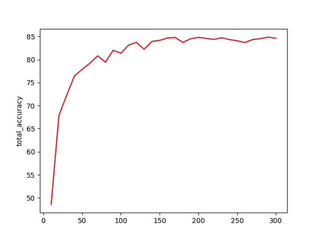

for every instrument:

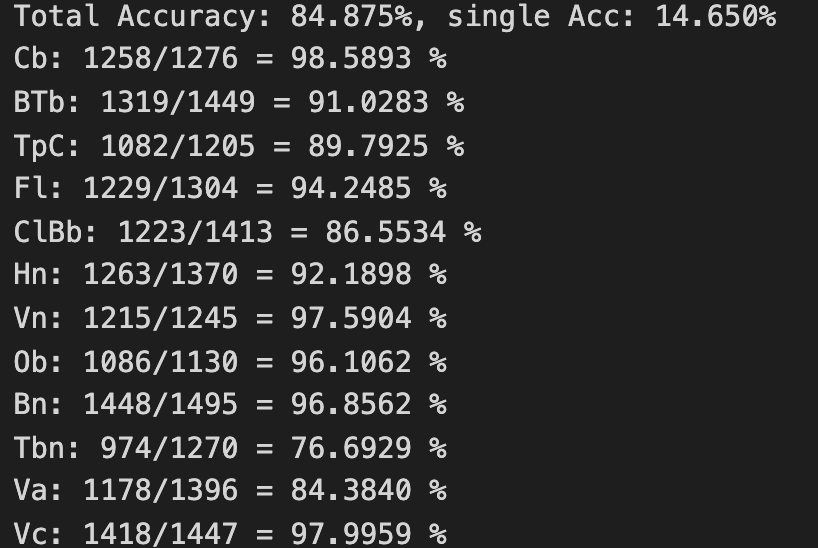

Loss:

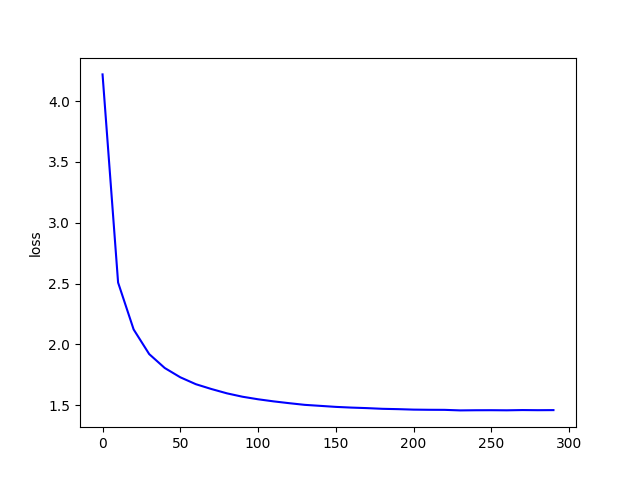

#### BottleNeck+Residual
Best acc: 80.037%

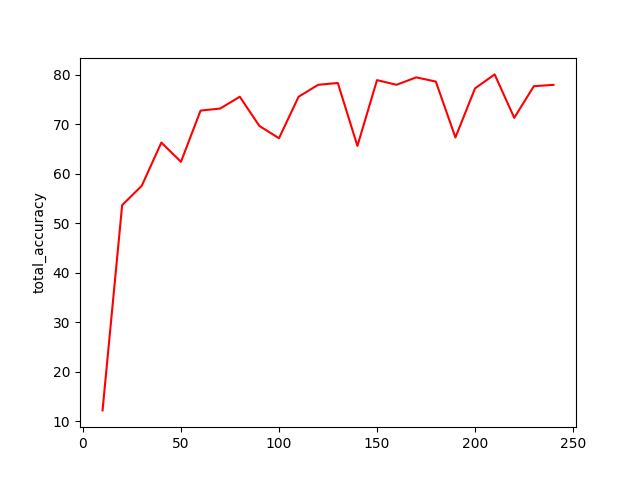

for every instrument:

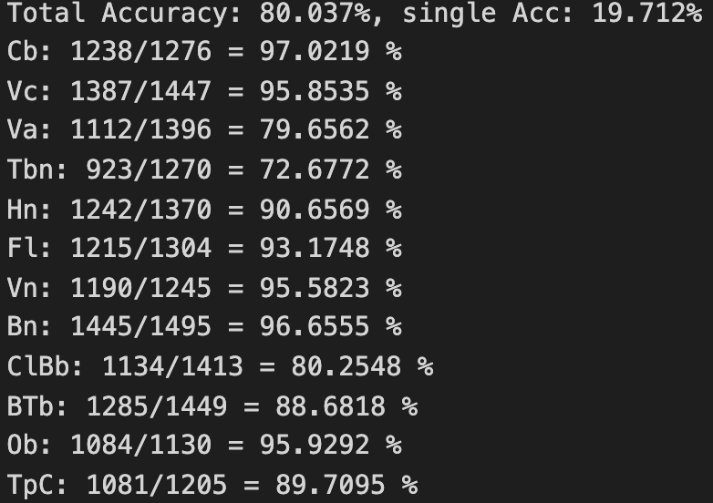

Loss:

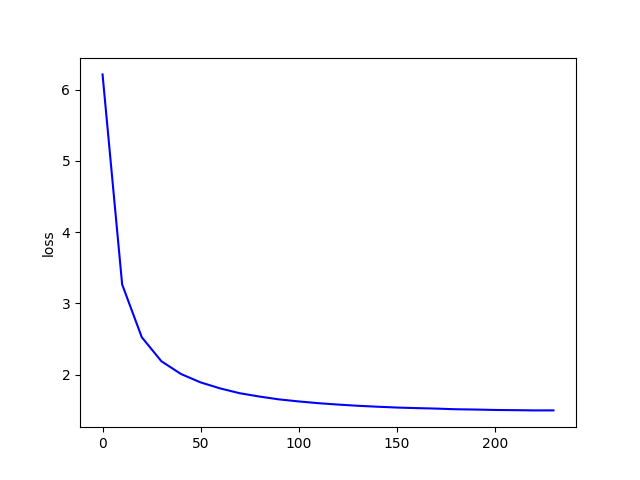

#### CNN+LSTM
Best acc: 80.688%

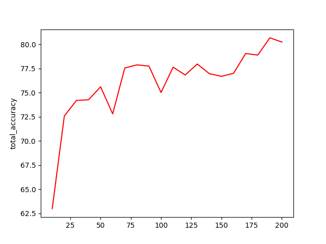

for every instrument:

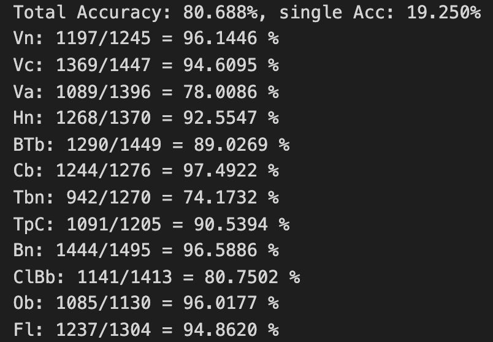

Loss:

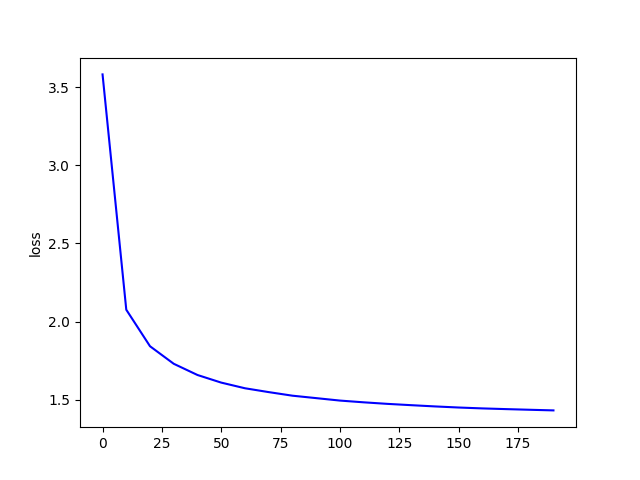

#### CNN+BiLSTM
Best acc: 67.513%

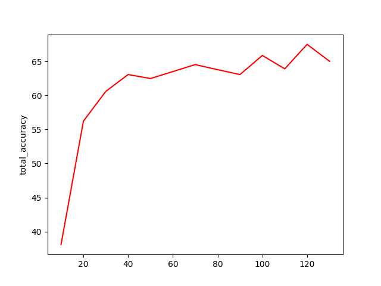

for every instrument:

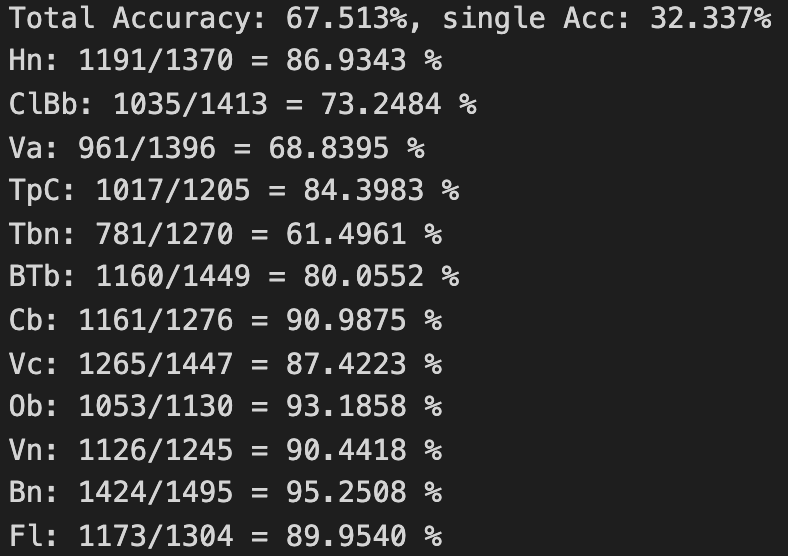

Loss:

#### CNN+LSTM+Residual
Best acc: 86.125%

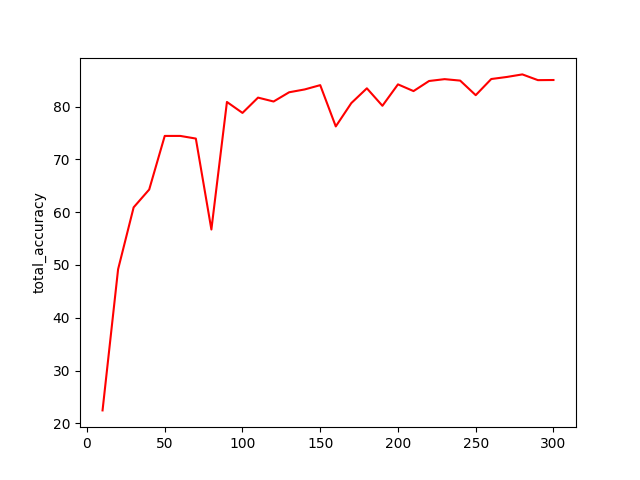

for every instrument:

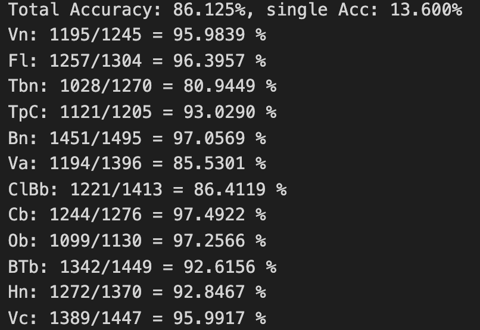

Loss:

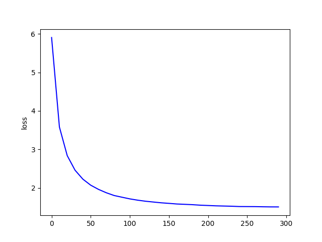

### Baseline(Only instrument recognition)
#### Random forrest (file mixture)
Random forrest(with 60 estimators) performs better than SVM 

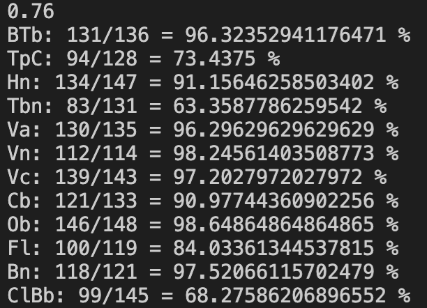

#### SVM
- Grid Search para with rbf kernel from C: 1 to 10000, gama: 0.0001 - 1, and get a best result of 71.12 %
- SVM with linear kernel shows better result which reaches a result of 71.99 % on test set
